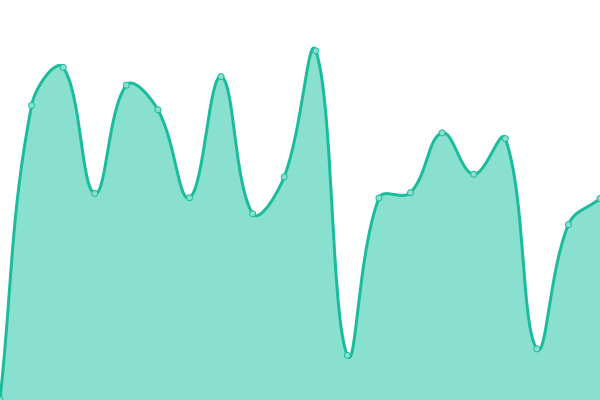
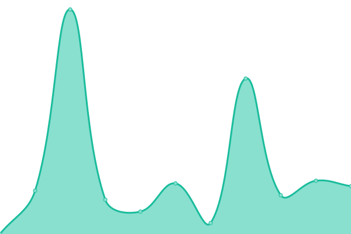

# [📈 Live Status](https://status.modem7.com): <!--live status--> **🟧 Partial outage**

This repository contains the open-source uptime monitor and status page for [Modem7](https://status.modem7.com), powered by [Upptime](https://github.com/upptime/upptime).

<!--start: status pages-->
<!-- This summary is generated by Upptime (https://github.com/upptime/upptime) -->
<!-- Do not edit this manually, your changes will be overwritten -->
<!-- prettier-ignore -->
| URL | Status | History | Response Time | Uptime |
| --- | ------ | ------- | ------------- | ------ |
|  [BorgBase](https://www.borgbase.com/) | 🟩 Up | [borg-base.yml](https://github.com/modem7/Status/commits/HEAD/history/borg-base.yml) | 

 157ms
     
 | 

<a href="https://status.modem7.com/history/borg-base">100.00%</a>
    

|  [Wiki](https://omegawiki.modem7.com) | 🟥 Down | [wiki.yml](https://github.com/modem7/Status/commits/HEAD/history/wiki.yml) | 

 1544ms
     
 | 

<a href="https://status.modem7.com/history/wiki">97.91%</a>
    

|  [Blog](https://modem7.wordpress.com/) | 🟩 Up | [blog.yml](https://github.com/modem7/Status/commits/HEAD/history/blog.yml) | 

 253ms
     
 | 

<a href="https://status.modem7.com/history/blog">100.00%</a>
    

|  Plex | 🟥 Down | [plex.yml](https://github.com/modem7/Status/commits/HEAD/history/plex.yml) | 

 609ms
     
 | 

<a href="https://status.modem7.com/history/plex">98.10%</a>
    

|  [Tautulli](https://tautulli.modem7.com/tautulli) | 🟥 Down | [tautulli.yml](https://github.com/modem7/Status/commits/HEAD/history/tautulli.yml) | 

 1763ms
     
 | 

<a href="https://status.modem7.com/history/tautulli">98.14%</a>
    

|  [Overseer](https://overseer.modem7.com) | 🟥 Down | [overseer.yml](https://github.com/modem7/Status/commits/HEAD/history/overseer.yml) | 

 2870ms
     
 | 

<a href="https://status.modem7.com/history/overseer">97.81%</a>
    

|  Sonarr | 🟥 Down | [sonarr.yml](https://github.com/modem7/Status/commits/HEAD/history/sonarr.yml) | 

 1073ms
     
 | 

<a href="https://status.modem7.com/history/sonarr">97.98%</a>
    

|  Radarr | 🟥 Down | [radarr.yml](https://github.com/modem7/Status/commits/HEAD/history/radarr.yml) | 

 1740ms
     
 | 

<a href="https://status.modem7.com/history/radarr">98.01%</a>
    

|  Prowlarr | 🟥 Down | [prowlarr.yml](https://github.com/modem7/Status/commits/HEAD/history/prowlarr.yml) | 

 767ms
     
 | 

<a href="https://status.modem7.com/history/prowlarr">98.06%</a>
    

|  Grafana | 🟩 Up | [grafana.yml](https://github.com/modem7/Status/commits/HEAD/history/grafana.yml) | 

 690ms
     
 | 

<a href="https://status.modem7.com/history/grafana">98.15%</a>
    

|  Netdata | 🟩 Up | [netdata.yml](https://github.com/modem7/Status/commits/HEAD/history/netdata.yml) | 

 2670ms
     
 | 

<a href="https://status.modem7.com/history/netdata">98.22%</a>
    

|  Flame | 🟥 Down | [flame.yml](https://github.com/modem7/Status/commits/HEAD/history/flame.yml) | 

 0ms
     
 | 

<a href="https://status.modem7.com/history/flame">100.00%</a>
    

|  Bitwarden | 🟩 Up | [bitwarden.yml](https://github.com/modem7/Status/commits/HEAD/history/bitwarden.yml) | 

 537ms
     
 | 

<a href="https://status.modem7.com/history/bitwarden">98.29%</a>
    

|  [DroneCI](https://drone.modem7.com) | 🟩 Up | [drone-ci.yml](https://github.com/modem7/Status/commits/HEAD/history/drone-ci.yml) | 

 692ms
     
 | 

<a href="https://status.modem7.com/history/drone-ci">98.33%</a>
    

|  Pastebin | 🟩 Up | [pastebin.yml](https://github.com/modem7/Status/commits/HEAD/history/pastebin.yml) | 

 708ms
     
 | 

<a href="https://status.modem7.com/history/pastebin">98.40%</a>
    

|  XBackbone | 🟥 Down | [x-backbone.yml](https://github.com/modem7/Status/commits/HEAD/history/x-backbone.yml) | 

 0ms
     
 | 

<a href="https://status.modem7.com/history/x-backbone">100.00%</a>
    

|  Pihole | 🟩 Up | [pihole.yml](https://github.com/modem7/Status/commits/HEAD/history/pihole.yml) | 

 933ms
     
 | 

<a href="https://status.modem7.com/history/pihole">98.44%</a>
    

|  Portainer | 🟩 Up | [portainer.yml](https://github.com/modem7/Status/commits/HEAD/history/portainer.yml) | 

 554ms
     
 | 

<a href="https://status.modem7.com/history/portainer">98.48%</a>
    

|  Dozzle | 🟩 Up | [dozzle.yml](https://github.com/modem7/Status/commits/HEAD/history/dozzle.yml) | 

 808ms
     
 | 

<a href="https://status.modem7.com/history/dozzle">98.51%</a>
    

<!--end: status pages-->

[**Visit the status website →**](https://status.modem7.com)

## 📄 License

- Powered by: [Upptime](https://github.com/upptime/upptime)
- Code: [MIT](./LICENSE) © [Anand Chowdhary](https://github.com/AnandChowdhary)
- Data in the `./history` directory: [Open Database License](https://opendatacommons.org/licenses/odbl/1-0/)
