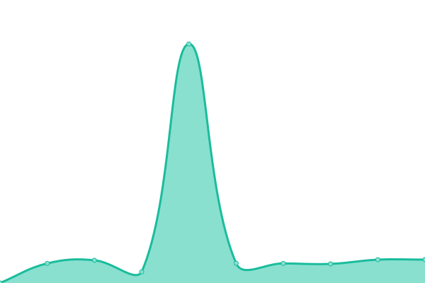
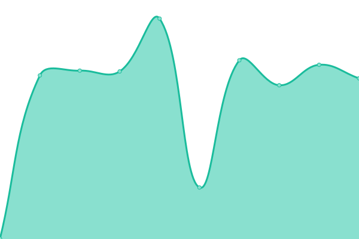
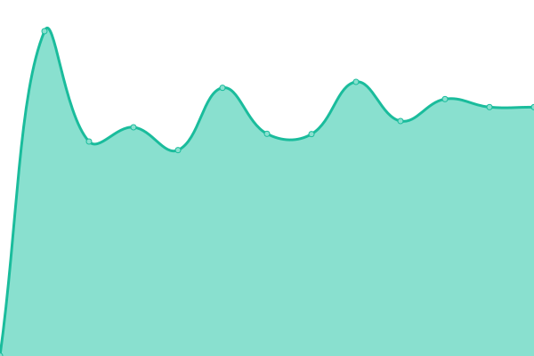
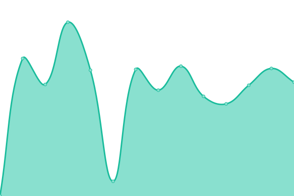
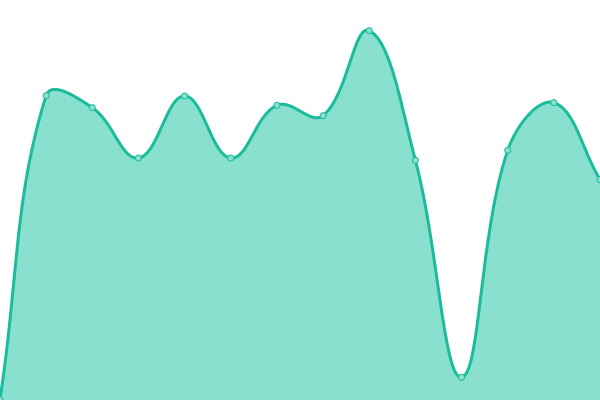
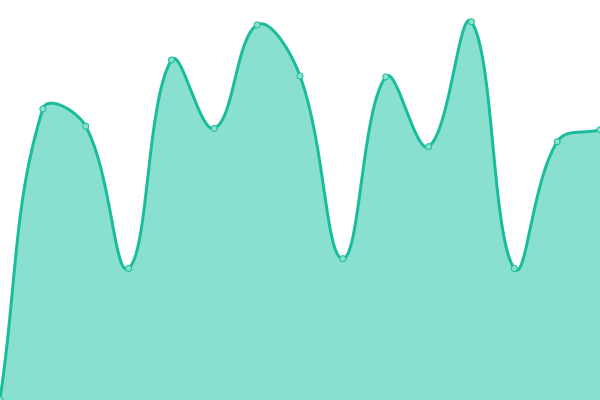
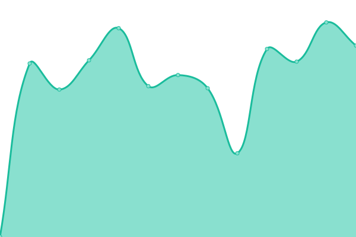
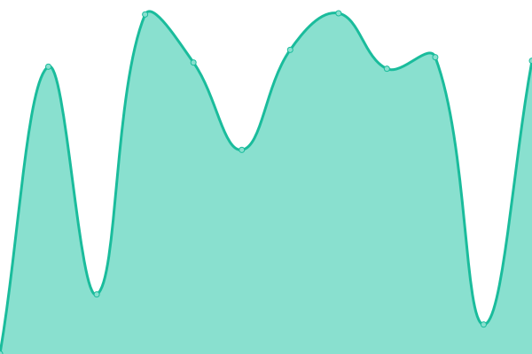

# [📈 Live Status](https://status.modem7.com): <!--live status--> **🟧 Partial outage**

This repository contains the open-source uptime monitor and status page for [Modem7](https://status.modem7.com), powered by [Upptime](https://github.com/upptime/upptime).

<!--start: status pages-->
<!-- This summary is generated by Upptime (https://github.com/upptime/upptime) -->
<!-- Do not edit this manually, your changes will be overwritten -->
<!-- prettier-ignore -->
| URL | Status | History | Response Time | Uptime |
| --- | ------ | ------- | ------------- | ------ |
|  [Google](https://www.google.com) | 🟩 Up | [google.yml](https://github.com/modem7/Status/commits/HEAD/history/google.yml) | 

 156ms
     
 | 

<a href="https://status.modem7.com/history/google">100.00%</a>
    

|  [BorgBase](https://www.borgbase.com/) | 🟩 Up | [borg-base.yml](https://github.com/modem7/Status/commits/HEAD/history/borg-base.yml) | 

 660ms
     
 | 

<a href="https://status.modem7.com/history/borg-base">100.00%</a>
    

|  [Wiki](https://omegawiki.modem7.com) | 🟩 Up | [wiki.yml](https://github.com/modem7/Status/commits/HEAD/history/wiki.yml) | 

 1315ms
     
 | 

<a href="https://status.modem7.com/history/wiki">100.00%</a>
    

|  [Blog](https://modem7.wordpress.com/) | 🟩 Up | [blog.yml](https://github.com/modem7/Status/commits/HEAD/history/blog.yml) | 

 317ms
     
 | 

<a href="https://status.modem7.com/history/blog">100.00%</a>
    

|  Plex | 🟩 Up | [plex.yml](https://github.com/modem7/Status/commits/HEAD/history/plex.yml) | 

 894ms
     
 | 

<a href="https://status.modem7.com/history/plex">100.00%</a>
    

|  [Tautulli](https://tautulli.modem7.com/tautulli) | 🟩 Up | [tautulli.yml](https://github.com/modem7/Status/commits/HEAD/history/tautulli.yml) | 

 1242ms
     
 | 

<a href="https://status.modem7.com/history/tautulli">100.00%</a>
    

|  [Overseer](https://overseer.modem7.com) | 🟩 Up | [overseer.yml](https://github.com/modem7/Status/commits/HEAD/history/overseer.yml) | 

 1338ms
     
 | 

<a href="https://status.modem7.com/history/overseer">100.00%</a>
    

|  [Ombi](https://ombi.modem7.com) | 🟩 Up | [ombi.yml](https://github.com/modem7/Status/commits/HEAD/history/ombi.yml) | 

 878ms
     
 | 

<a href="https://status.modem7.com/history/ombi">100.00%</a>
    

|  Sonarr | 🟩 Up | [sonarr.yml](https://github.com/modem7/Status/commits/HEAD/history/sonarr.yml) | 

 1537ms
     
 | 

<a href="https://status.modem7.com/history/sonarr">100.00%</a>
    

|  Radarr | 🟩 Up | [radarr.yml](https://github.com/modem7/Status/commits/HEAD/history/radarr.yml) | 

 1186ms
     
 | 

<a href="https://status.modem7.com/history/radarr">100.00%</a>
    

|  Bazarr | 🟩 Up | [bazarr.yml](https://github.com/modem7/Status/commits/HEAD/history/bazarr.yml) | 

 1230ms
     
 | 

<a href="https://status.modem7.com/history/bazarr">100.00%</a>
    

|  NZBHydra2 | 🟩 Up | [nzb-hydra2.yml](https://github.com/modem7/Status/commits/HEAD/history/nzb-hydra2.yml) | 

 1201ms
     
 | 

<a href="https://status.modem7.com/history/nzb-hydra2">100.00%</a>
    

|  Grafana | 🟩 Up | [grafana.yml](https://github.com/modem7/Status/commits/HEAD/history/grafana.yml) | 

 564ms
     
 | 

<a href="https://status.modem7.com/history/grafana">100.00%</a>
    

|  Netdata | 🟩 Up | [netdata.yml](https://github.com/modem7/Status/commits/HEAD/history/netdata.yml) | 

 742ms
     
 | 

<a href="https://status.modem7.com/history/netdata">100.00%</a>
    

|  [Heimdall](https://alexlane.modem7.com) | 🟩 Up | [heimdall.yml](https://github.com/modem7/Status/commits/HEAD/history/heimdall.yml) | 

 974ms
     
 | 

<a href="https://status.modem7.com/history/heimdall">100.00%</a>
    

|  Bitwarden | 🟩 Up | [bitwarden.yml](https://github.com/modem7/Status/commits/HEAD/history/bitwarden.yml) | 

 639ms
     
 | 

<a href="https://status.modem7.com/history/bitwarden">100.00%</a>
    

|  [DroneCI](https://drone.modem7.com) | 🟩 Up | [drone-ci.yml](https://github.com/modem7/Status/commits/HEAD/history/drone-ci.yml) | 

 879ms
     
 | 

<a href="https://status.modem7.com/history/drone-ci">100.00%</a>
    

|  Hastebin | 🟩 Up | [hastebin.yml](https://github.com/modem7/Status/commits/HEAD/history/hastebin.yml) | 

 730ms
     
 | 

<a href="https://status.modem7.com/history/hastebin">100.00%</a>
    

|  XBackbone | 🟩 Up | [x-backbone.yml](https://github.com/modem7/Status/commits/HEAD/history/x-backbone.yml) | 

 1296ms
     
 | 

<a href="https://status.modem7.com/history/x-backbone">100.00%</a>
    

|  Pihole | 🟩 Up | [pihole.yml](https://github.com/modem7/Status/commits/HEAD/history/pihole.yml) | 

 770ms
     
 | 

<a href="https://status.modem7.com/history/pihole">100.00%</a>
    

|  3CX | 🟥 Down | [3-cx.yml](https://github.com/modem7/Status/commits/HEAD/history/3-cx.yml) | 

 567ms
     
 | 

<a href="https://status.modem7.com/history/3-cx">99.23%</a>
    

|  Portainer | 🟩 Up | [portainer.yml](https://github.com/modem7/Status/commits/HEAD/history/portainer.yml) | 

 715ms
     
 | 

<a href="https://status.modem7.com/history/portainer">100.00%</a>
    

|  [Scrutiny](https://scrutiny.modem7.com/) | 🟩 Up | [scrutiny.yml](https://github.com/modem7/Status/commits/HEAD/history/scrutiny.yml) | 

 1091ms
     
 | 

<a href="https://status.modem7.com/history/scrutiny">100.00%</a>
    

|  Dozzle | 🟩 Up | [dozzle.yml](https://github.com/modem7/Status/commits/HEAD/history/dozzle.yml) | 

 1228ms
     
 | 

<a href="https://status.modem7.com/history/dozzle">100.00%</a>
    

<!--end: status pages-->

[**Visit the status website →**](https://status.modem7.com)

## 📄 License

- Powered by: [Upptime](https://github.com/upptime/upptime)
- Code: [MIT](./LICENSE) © [Anand Chowdhary](https://github.com/AnandChowdhary)
- Data in the `./history` directory: [Open Database License](https://opendatacommons.org/licenses/odbl/1-0/)
