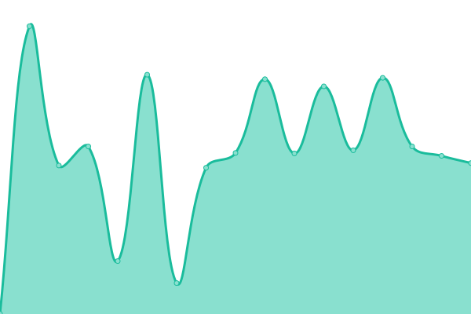

# [📈 Live Status](https://status.modem7.com): <!--live status--> **🟩 All systems operational**

This repository contains the open-source uptime monitor and status page for [Modem7](https://status.modem7.com), powered by [Upptime](https://github.com/upptime/upptime).

<!--start: status pages-->
<!-- This summary is generated by Upptime (https://github.com/upptime/upptime) -->
<!-- Do not edit this manually, your changes will be overwritten -->
<!-- prettier-ignore -->
| URL | Status | History | Response Time | Uptime |
| --- | ------ | ------- | ------------- | ------ |
|  [Google](https://www.google.com) | 🟩 Up | [google.yml](https://github.com/modem7/Status/commits/HEAD/history/google.yml) | 

 101ms
     
 | 

<a href="https://status.modem7.com/history/google">100.00%</a>
    

|  [BorgBase](https://www.borgbase.com/) | 🟩 Up | [borg-base.yml](https://github.com/modem7/Status/commits/HEAD/history/borg-base.yml) | 

 511ms
     
 | 

<a href="https://status.modem7.com/history/borg-base">100.00%</a>
    

|  [Wiki](https://omegawiki.modem7.com) | 🟩 Up | [wiki.yml](https://github.com/modem7/Status/commits/HEAD/history/wiki.yml) | 

 1549ms
     
 | 

<a href="https://status.modem7.com/history/wiki">100.00%</a>
    

|  [Blog](https://modem7.wordpress.com/) | 🟩 Up | [blog.yml](https://github.com/modem7/Status/commits/HEAD/history/blog.yml) | 

 348ms
     
 | 

<a href="https://status.modem7.com/history/blog">100.00%</a>
    

|  Plex | 🟩 Up | [plex.yml](https://github.com/modem7/Status/commits/HEAD/history/plex.yml) | 

 617ms
     
 | 

<a href="https://status.modem7.com/history/plex">100.00%</a>
    

|  [Tautulli](https://tautulli.modem7.com/tautulli) | 🟩 Up | [tautulli.yml](https://github.com/modem7/Status/commits/HEAD/history/tautulli.yml) | 

 775ms
     
 | 

<a href="https://status.modem7.com/history/tautulli">100.00%</a>
    

|  [Overseer](https://overseer.modem7.com) | 🟩 Up | [overseer.yml](https://github.com/modem7/Status/commits/HEAD/history/overseer.yml) | 

 818ms
     
 | 

<a href="https://status.modem7.com/history/overseer">100.00%</a>
    

|  [Ombi](https://ombi.modem7.com) | 🟩 Up | [ombi.yml](https://github.com/modem7/Status/commits/HEAD/history/ombi.yml) | 

 615ms
     
 | 

<a href="https://status.modem7.com/history/ombi">100.00%</a>
    

|  Sonarr | 🟩 Up | [sonarr.yml](https://github.com/modem7/Status/commits/HEAD/history/sonarr.yml) | 

 1139ms
     
 | 

<a href="https://status.modem7.com/history/sonarr">100.00%</a>
    

|  Radarr | 🟩 Up | [radarr.yml](https://github.com/modem7/Status/commits/HEAD/history/radarr.yml) | 

 792ms
     
 | 

<a href="https://status.modem7.com/history/radarr">100.00%</a>
    

|  Bazarr | 🟩 Up | [bazarr.yml](https://github.com/modem7/Status/commits/HEAD/history/bazarr.yml) | 

 795ms
     
 | 

<a href="https://status.modem7.com/history/bazarr">100.00%</a>
    

|  NZBHydra2 | 🟩 Up | [nzb-hydra2.yml](https://github.com/modem7/Status/commits/HEAD/history/nzb-hydra2.yml) | 

 797ms
     
 | 

<a href="https://status.modem7.com/history/nzb-hydra2">100.00%</a>
    

|  Grafana | 🟩 Up | [grafana.yml](https://github.com/modem7/Status/commits/HEAD/history/grafana.yml) | 

 2908ms
     
 | 

<a href="https://status.modem7.com/history/grafana">100.00%</a>
    

|  Netdata | 🟩 Up | [netdata.yml](https://github.com/modem7/Status/commits/HEAD/history/netdata.yml) | 

 652ms
     
 | 

<a href="https://status.modem7.com/history/netdata">100.00%</a>
    

|  Flame | 🟩 Up | [flame.yml](https://github.com/modem7/Status/commits/HEAD/history/flame.yml) | 

 613ms
     
 | 

<a href="https://status.modem7.com/history/flame">100.00%</a>
    

|  Bitwarden | 🟩 Up | [bitwarden.yml](https://github.com/modem7/Status/commits/HEAD/history/bitwarden.yml) | 

 477ms
     
 | 

<a href="https://status.modem7.com/history/bitwarden">100.00%</a>
    

|  [DroneCI](https://drone.modem7.com) | 🟩 Up | [drone-ci.yml](https://github.com/modem7/Status/commits/HEAD/history/drone-ci.yml) | 

 633ms
     
 | 

<a href="https://status.modem7.com/history/drone-ci">100.00%</a>
    

|  Hastebin | 🟩 Up | [hastebin.yml](https://github.com/modem7/Status/commits/HEAD/history/hastebin.yml) | 

 655ms
     
 | 

<a href="https://status.modem7.com/history/hastebin">100.00%</a>
    

|  XBackbone | 🟩 Up | [x-backbone.yml](https://github.com/modem7/Status/commits/HEAD/history/x-backbone.yml) | 

 900ms
     
 | 

<a href="https://status.modem7.com/history/x-backbone">100.00%</a>
    

|  Pihole | 🟩 Up | [pihole.yml](https://github.com/modem7/Status/commits/HEAD/history/pihole.yml) | 

 664ms
     
 | 

<a href="https://status.modem7.com/history/pihole">100.00%</a>
    

|  Portainer | 🟩 Up | [portainer.yml](https://github.com/modem7/Status/commits/HEAD/history/portainer.yml) | 

 848ms
     
 | 

<a href="https://status.modem7.com/history/portainer">100.00%</a>
    

|  [Scrutiny](https://scrutiny.modem7.com/) | 🟩 Up | [scrutiny.yml](https://github.com/modem7/Status/commits/HEAD/history/scrutiny.yml) | 

 887ms
     
 | 

<a href="https://status.modem7.com/history/scrutiny">100.00%</a>
    

|  Dozzle | 🟩 Up | [dozzle.yml](https://github.com/modem7/Status/commits/HEAD/history/dozzle.yml) | 

 836ms
     
 | 

<a href="https://status.modem7.com/history/dozzle">100.00%</a>
    

|  Snapdrop | 🟩 Up | [snapdrop.yml](https://github.com/modem7/Status/commits/HEAD/history/snapdrop.yml) | 

 477ms
     
 | 

<a href="https://status.modem7.com/history/snapdrop">100.00%</a>
    

<!--end: status pages-->

[**Visit the status website →**](https://status.modem7.com)

## 📄 License

- Powered by: [Upptime](https://github.com/upptime/upptime)
- Code: [MIT](./LICENSE) © [Anand Chowdhary](https://github.com/AnandChowdhary)
- Data in the `./history` directory: [Open Database License](https://opendatacommons.org/licenses/odbl/1-0/)
