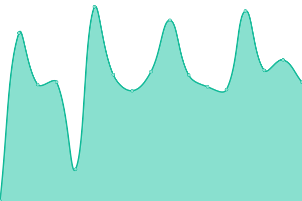

# [📈 Live Status](https://status.modem7.com): <!--live status--> **🟧 Partial outage**

This repository contains the open-source uptime monitor and status page for [Modem7](https://status.modem7.com), powered by [Upptime](https://github.com/upptime/upptime).

<!--start: status pages-->
<!-- This summary is generated by Upptime (https://github.com/upptime/upptime) -->
<!-- Do not edit this manually, your changes will be overwritten -->
<!-- prettier-ignore -->
| URL | Status | History | Response Time | Uptime |
| --- | ------ | ------- | ------------- | ------ |
|  [BorgBase](https://www.borgbase.com/) | 🟩 Up | [borg-base.yml](https://github.com/modem7/Status/commits/HEAD/history/borg-base.yml) | 

 160ms
     
 | 

<a href="https://status.modem7.com/history/borg-base">100.00%</a>
    

|  [Wiki](https://omegawiki.modem7.com) | 🟥 Down | [wiki.yml](https://github.com/modem7/Status/commits/HEAD/history/wiki.yml) | 

 942ms
     
 | 

<a href="https://status.modem7.com/history/wiki">99.99%</a>
    

|  [Blog](https://modem7.wordpress.com/) | 🟩 Up | [blog.yml](https://github.com/modem7/Status/commits/HEAD/history/blog.yml) | 

 297ms
     
 | 

<a href="https://status.modem7.com/history/blog">100.00%</a>
    

|  Plex | 🟥 Down | [plex.yml](https://github.com/modem7/Status/commits/HEAD/history/plex.yml) | 

 516ms
     
 | 

<a href="https://status.modem7.com/history/plex">99.99%</a>
    

|  [Tautulli](https://tautulli.modem7.com/tautulli) | 🟥 Down | [tautulli.yml](https://github.com/modem7/Status/commits/HEAD/history/tautulli.yml) | 

 825ms
     
 | 

<a href="https://status.modem7.com/history/tautulli">99.99%</a>
    

|  [Overseer](https://overseer.modem7.com) | 🟥 Down | [overseer.yml](https://github.com/modem7/Status/commits/HEAD/history/overseer.yml) | 

 939ms
     
 | 

<a href="https://status.modem7.com/history/overseer">99.99%</a>
    

|  Sonarr | 🟥 Down | [sonarr.yml](https://github.com/modem7/Status/commits/HEAD/history/sonarr.yml) | 

 942ms
     
 | 

<a href="https://status.modem7.com/history/sonarr">99.99%</a>
    

|  Radarr | 🟥 Down | [radarr.yml](https://github.com/modem7/Status/commits/HEAD/history/radarr.yml) | 

 647ms
     
 | 

<a href="https://status.modem7.com/history/radarr">99.99%</a>
    

|  Prowlarr | 🟥 Down | [prowlarr.yml](https://github.com/modem7/Status/commits/HEAD/history/prowlarr.yml) | 

 638ms
     
 | 

<a href="https://status.modem7.com/history/prowlarr">99.99%</a>
    

|  Grafana | 🟥 Down | [grafana.yml](https://github.com/modem7/Status/commits/HEAD/history/grafana.yml) | 

 2836ms
     
 | 

<a href="https://status.modem7.com/history/grafana">99.99%</a>
    

|  Flame | 🟥 Down | [flame.yml](https://github.com/modem7/Status/commits/HEAD/history/flame.yml) | 

 0ms
     
 | 

<a href="https://status.modem7.com/history/flame">100.00%</a>
    

|  Bitwarden | 🟥 Down | [bitwarden.yml](https://github.com/modem7/Status/commits/HEAD/history/bitwarden.yml) | 

 680ms
     
 | 

<a href="https://status.modem7.com/history/bitwarden">99.99%</a>
    

|  [DroneCI](https://drone.modem7.com) | 🟥 Down | [drone-ci.yml](https://github.com/modem7/Status/commits/HEAD/history/drone-ci.yml) | 

 649ms
     
 | 

<a href="https://status.modem7.com/history/drone-ci">99.99%</a>
    

|  Pastebin | 🟥 Down | [pastebin.yml](https://github.com/modem7/Status/commits/HEAD/history/pastebin.yml) | 

 613ms
     
 | 

<a href="https://status.modem7.com/history/pastebin">99.99%</a>
    

|  XBackbone | 🟥 Down | [x-backbone.yml](https://github.com/modem7/Status/commits/HEAD/history/x-backbone.yml) | 

 0ms
     
 | 

<a href="https://status.modem7.com/history/x-backbone">100.00%</a>
    

|  Pihole | 🟥 Down | [pihole.yml](https://github.com/modem7/Status/commits/HEAD/history/pihole.yml) | 

 870ms
     
 | 

<a href="https://status.modem7.com/history/pihole">99.99%</a>
    

|  Portainer | 🟥 Down | [portainer.yml](https://github.com/modem7/Status/commits/HEAD/history/portainer.yml) | 

 572ms
     
 | 

<a href="https://status.modem7.com/history/portainer">99.99%</a>
    

|  Dozzle | 🟩 Up | [dozzle.yml](https://github.com/modem7/Status/commits/HEAD/history/dozzle.yml) | 

 660ms
     
 | 

<a href="https://status.modem7.com/history/dozzle">100.00%</a>
    

<!--end: status pages-->

[**Visit the status website →**](https://status.modem7.com)

## 📄 License

- Powered by: [Upptime](https://github.com/upptime/upptime)
- Code: [MIT](./LICENSE) © [Anand Chowdhary](https://github.com/AnandChowdhary)
- Data in the `./history` directory: [Open Database License](https://opendatacommons.org/licenses/odbl/1-0/)
